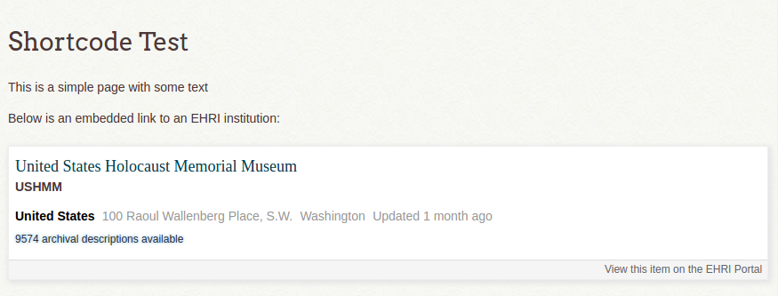

EHRI Omeka Plugin
=================

This plugin provides integration with the [EHRI portal API](https://portal.ehri-project.eu/api).

Currently it just adds a [shortcode](https://omeka.org/codex/Shortcodes) to embed abbreviated descriptions
of EHRI institutions, documentary unit items, or authority files into Omeka Simple Pages.

The shortcode is called `ehri_item_data` and requires an `id` argument with the value of the EHRI item ID, for
example:

```
    [ehri_item_data id="us-005578"]
```

Would result in something like:



## Installation

Extract the source root to a directory called `EhriData` in the Omeka `plugins/` folder. **Note**: you must use the name `EhriData` or Omeka will not recognise the plugin correctly.